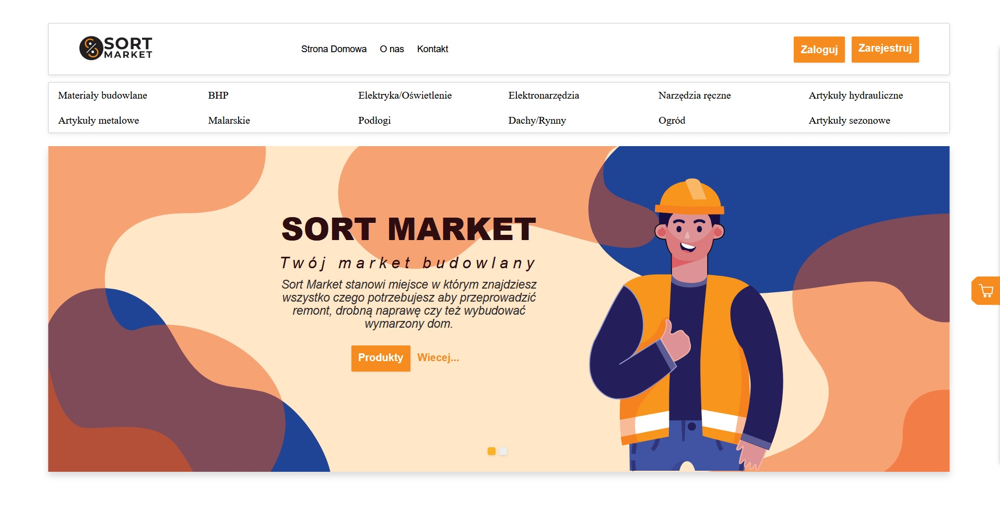
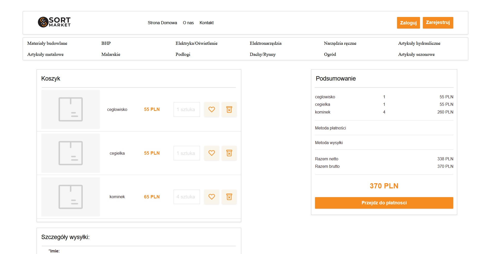
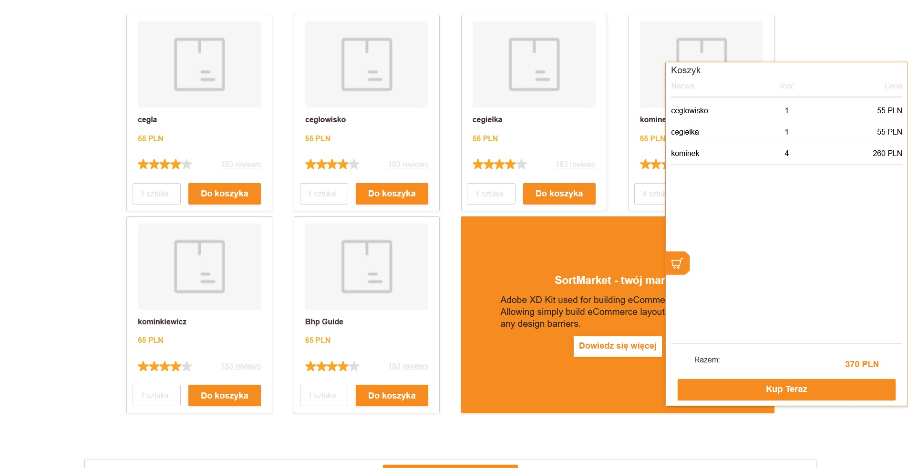
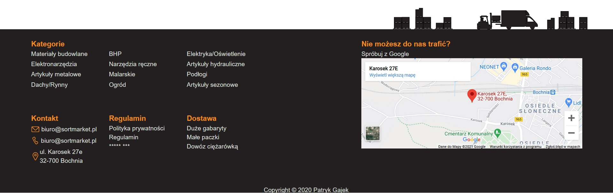
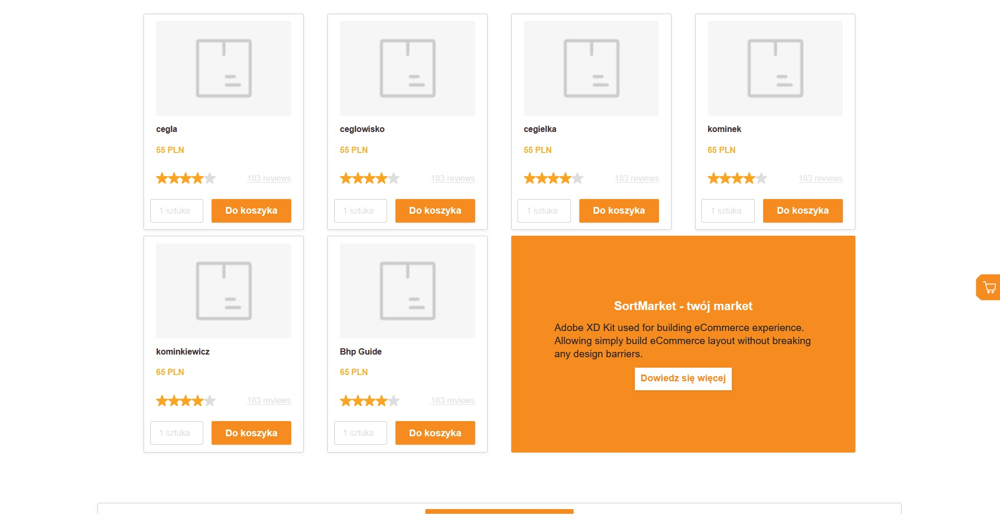

# SORT MARKET(WORK IN PROGRESS)

> An ecommerce website, for SortMarket constructional warehause.
> Integrated with own NodeJS backend aplication and COMARCH ERP OPTIMA.

## Table of contents

- [Screenshots](#screenshots)
- [Technologies](#technologies)
- [Setup](#setup)
- [todo](#todo)
- [Status](#status)
- [Contact](#contact)

## Screenshots

## Technologies

-@rehooks/component-size: ^1.0.3,
-@testing-library/jest-dom : ^5.11.6 ,
-@testing-library/react : ^11.2.2 ,
-@testing-library/user-event : ^12.6.0 ,
-axios : ^0.21.1 ,
-js-cookie : ^2.2.1 ,
-node-sass : ^4.14.1 ,
-react : ^17.0.1 ,
-react-dom : ^17.0.1 ,
-react-hook-form : ^6.15.1 ,
-react-redux : ^7.2.2 ,
-react-router : ^5.2.0 ,
-react-router-dom : ^5.2.0 ,
-react-scripts : 4.0.1 ,
-redux : ^4.0.5 ,
-redux-thunk : ^2.3.0 ,
-web-vitals : ^0.2.4

## Setup

U can use NPM INSTALL and then NPM START in your console.

## TO-DO

To-do list:

- User interface
- Stripe Payments
- Api integration at backend side with COMARCH ERP OPTIMA

## Status

Project is: _in progress_

## Contact

Created by Patryk Gajek Github: https://github.com/pgajek
